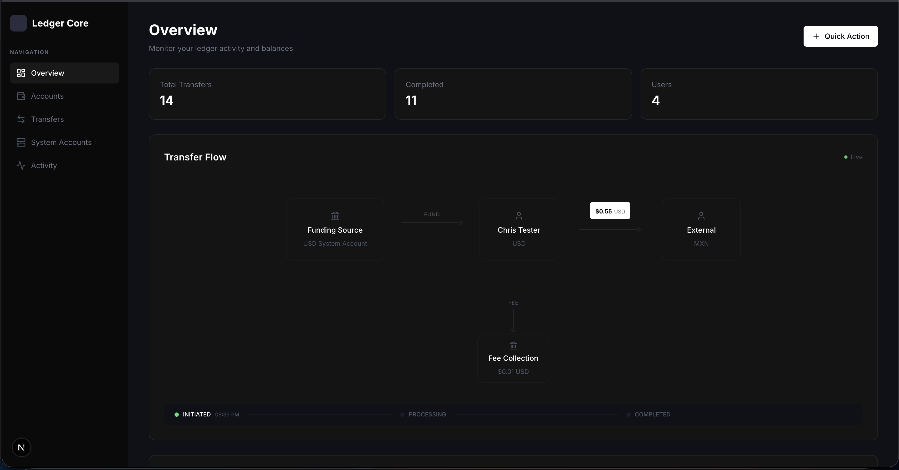
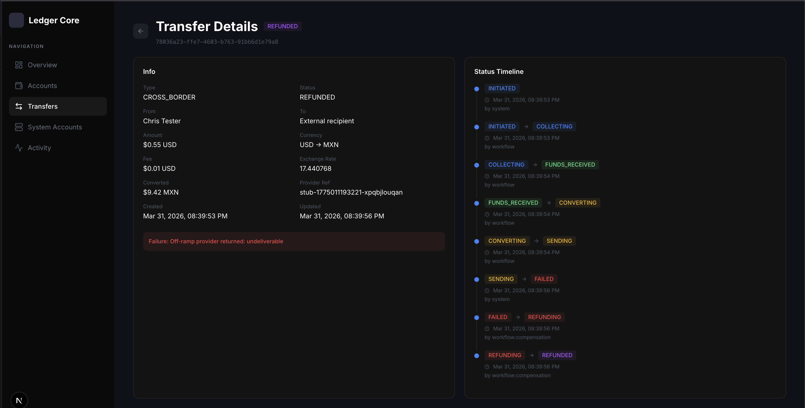
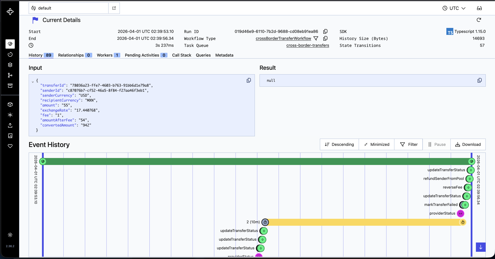
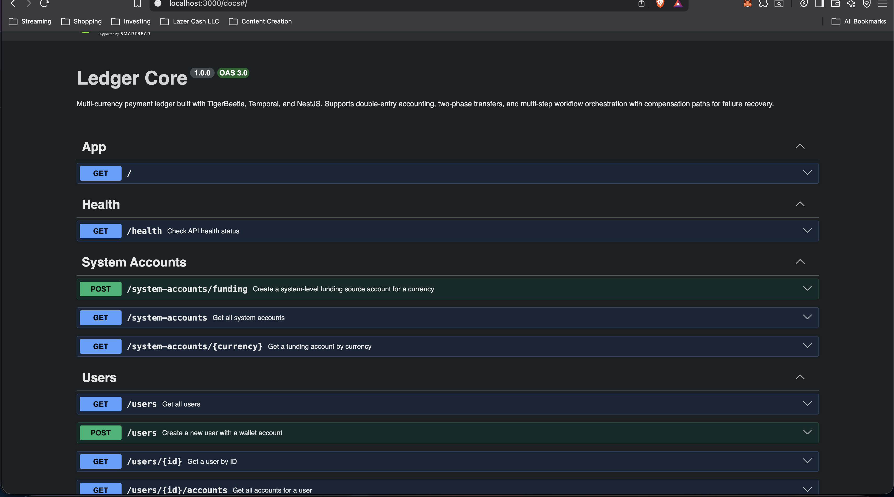

# Ledger Core

Multi-currency payment ledger with double-entry accounting, workflow orchestration, and provider-agnostic payment integration.

Built with [NestJS](https://nestjs.com), [TigerBeetle](https://tigerbeetle.com), [PostgreSQL](https://www.postgresql.org), [Redis](https://redis.io), and [Temporal](https://temporal.io).

## Screenshots


*Dashboard with transfer flow visualizer, stats, and system accounts*


*Cross-border transfer with full compensation path: INITIATED through REFUNDED*


*Temporal UI showing workflow execution, activities, and webhook signals*


*API documentation via Swagger*

## What This Is

A backend system for processing financial transfers. Handles same-currency and cross-border payments with exchange rates, fee collection, status tracking, and failure recovery.

Designed as a generic ledger that any payment application can build on top of. Provider integrations are swappable via an adapter pattern.

## Architecture

```
Client -> NestJS API -> TigerBeetle (double-entry ledger)
                    |-> PostgreSQL (users, transfers, audit trail)
                    |-> Redis (idempotency, quote caching)
                    |-> Temporal (workflow orchestration)
                    |-> Payment Provider (stub / real)
```

**TigerBeetle** handles all money movement with strict double-entry accounting. Every transfer debits one account and credits another. User wallets enforce `debits_must_not_exceed_credits` at the ledger level.

**PostgreSQL** stores relational data: users, transfer metadata, status history, provider events. Prisma ORM with migrations.

**Redis** provides fast idempotency checks (24h TTL) and exchange rate quote locking (30s TTL).

**Temporal** orchestrates cross-border transfers as durable workflows. If the server crashes mid-transfer, Temporal replays the workflow from where it left off. Includes compensation paths that reverse fee collection and refund the sender on failure.

## System Accounts

On startup, the API seeds four system account types per supported currency:

| Type | Purpose |
|------|---------|
| FUNDING_SOURCE | Money entering the system (on-ramp) |
| INTERNAL_POOL | Holds money during conversion/transit |
| FEE_COLLECTION | Accumulated transfer fees (1.5%) |
| OFF_RAMP | Money exiting the system (off-ramp) |

## Transfer Flows

**Same-currency** (instant): Sender wallet -> Recipient wallet via TigerBeetle. Completes synchronously.

**Cross-border** (async, Temporal workflow):
```
Sender Wallet -> Pool -> Fee Collection
                      -> Provider On-Ramp (webhook-driven)
                      -> Conversion
                      -> Provider Off-Ramp (webhook-driven)
                      -> Completed (or Refunded on failure)
```

Status transitions are validated by a state machine. Full audit trail in `transfer_status_history` and `provider_events` tables.

## Quick Start

```bash
# Clone and install
git clone <repo-url>
cd ledger-core
pnpm install

# Copy env and configure
cp .env.example .env

# Start all services
docker compose up -d

# API available at http://localhost:3000
# Swagger docs at http://localhost:3000/docs
# Temporal UI at http://localhost:8080
```

See [api/README.md](api/README.md) for detailed endpoint documentation, Prisma commands, and the demo script.

## Project Structure

```
ledger-core/
  api/                    # NestJS API
    src/
      modules/
        health/           # Health check endpoint
        users/            # User and wallet management
        transfers/        # Same-currency and cross-border transfers
        ledger/           # TigerBeetle client and system accounts
        providers/        # Payment provider adapter + stub
        webhooks/         # Incoming provider status updates
        quotes/           # Exchange rate quotes with TTL
        temporal/         # Workflow definitions and activities
        redis/            # Redis client service
        prisma/           # Database client
    prisma/               # Schema and migrations
    scripts/              # Demo and seed scripts
  packages/
    shared/               # Shared types and enums
  web/                    # Next.js dashboard (WIP)
  temporal/               # Temporal server config
  compose.yml             # Docker Compose for all services
```

## Supported Currencies

USD, USDC, MXN, COP, CAD, GHS, NGN

## Pre-Production Checklist

The following are intentionally excluded from this development build and should be addressed before any production deployment:

- Webhook signature verification (HMAC)
- CORS origin restrictions
- API pagination on list endpoints
- Rate limiting
- Temporal worker process separation
- Provider-specific currency validation on DTOs
- Secrets management (currently in .env)

## Tech Stack

| Component | Technology |
|-----------|-----------|
| API | NestJS (TypeScript) |
| Ledger | TigerBeetle |
| Database | PostgreSQL + Prisma |
| Cache | Redis (ioredis) |
| Workflows | Temporal |
| Dashboard | Next.js |
| Containers | Docker Compose |

## License

MIT
